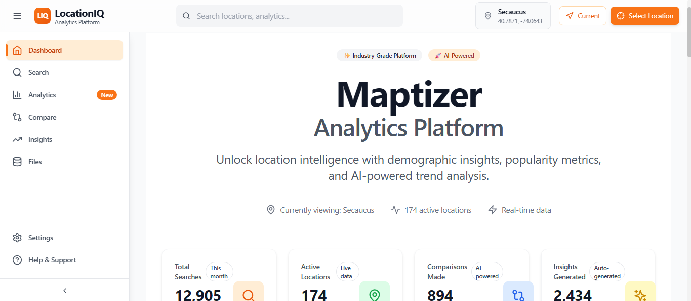
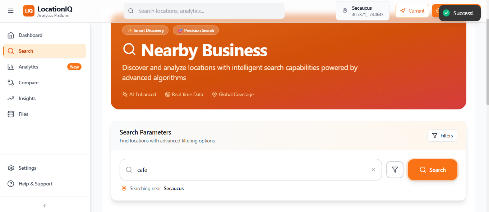
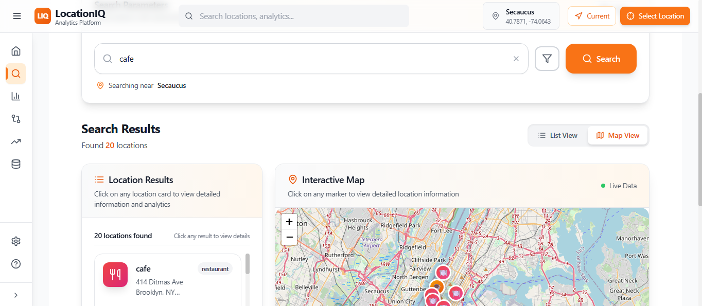
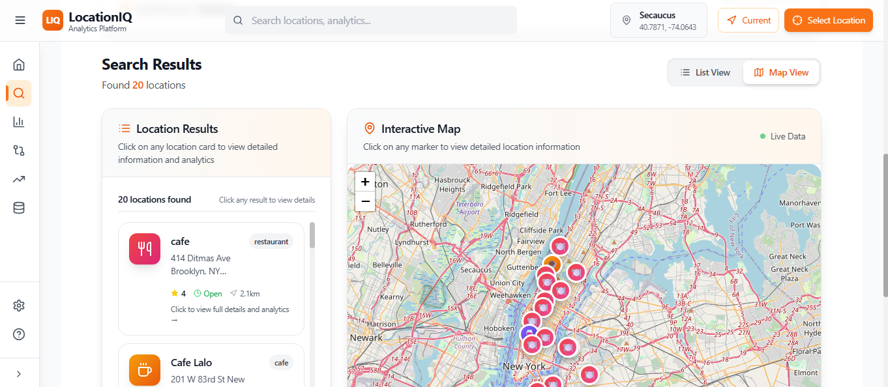
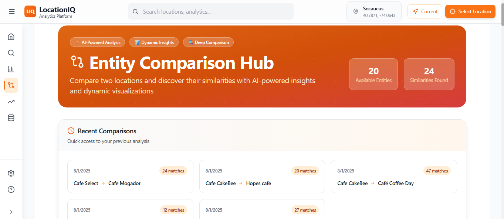
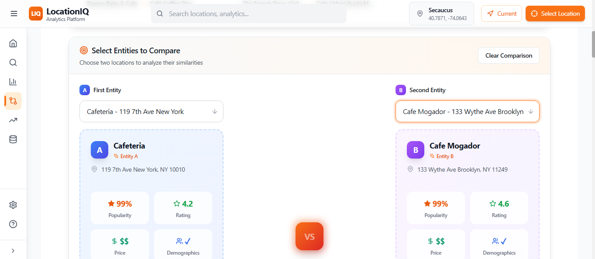
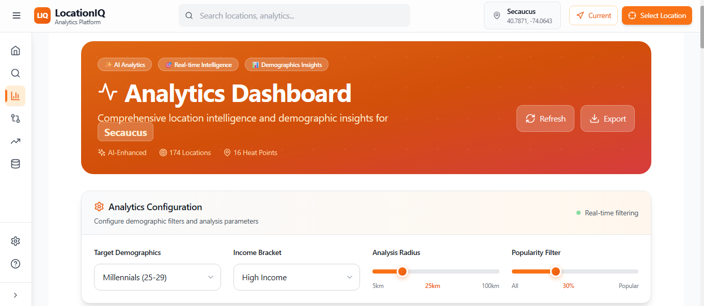
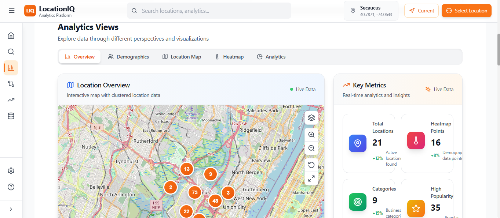
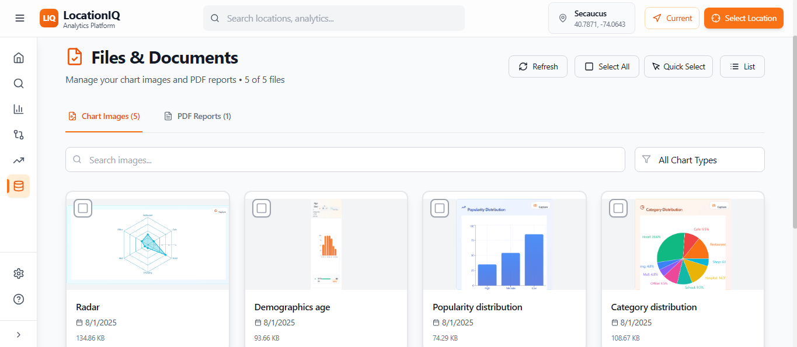
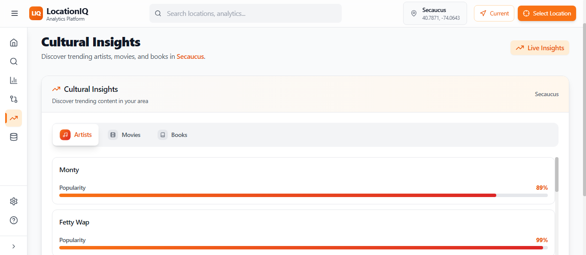

# 🗺️ Maptizer: Geo-AI Platform for Smart Location Intelligence

Maptizer is a powerful **Geospatial Analytics Platform** combining full-scale map interaction with AI-powered insights. Designed for developers, analysts, and researchers, it provides real-time, location-based intelligence using rich spatial data and intelligent visualization layers.


Harness the potential of **LocationIQ**, **Tailwind CSS**, **Vite**, **Qloo APIs**, and custom **AI/ML models** to extract actionable insights from maps, users, and dynamic geolocated data.

---

[](https://github.com/THILLAINATARAJAN-B/Maptizer)
[](https://tailwindcss.com/)
[](https://vitejs.dev/)

---

## 🌍 What is Maptizer?

> "Mapping meets Machine Learning — uncover patterns, predict trends, and interact with maps like never before."

Maptizer helps users evaluate **location feasibility** for businesses or events by analyzing geospatial data, culture, people behavior, and demand trends. Our integration with the **Qloo API** enables cultural, interest, and demographic insights based on location and tags (like cafés, gyms, art spaces, etc.).

---

## 🎯 Project Goal

Enable any user to:

- Select a **location** and **interest tags** (e.g., "tea shop", "bookstore", "music")
- Use **Qloo's entity and insight APIs** to gather population behavior, taste profiles, and location tags
- Run AI/ML-powered **business feasibility analysis**
- Get **data-driven predictions** using charts, heatmaps, and geo-visual analytics

---

## 📸 Platform Screenshots

### 🏠 Homepage – Modern Dashboard Interface  


### 🔍 Search Dashboard – AI-Enhanced Discovery  
  
  


### 🧠 Comparison Dashboard – Location Intelligence  
  


### 📊 Analytics Dashboard – Demographic Insights  
  


### 📂 File Base – Structured Data Access  


### 🧭 Location Insights – Smart Intelligence  


---

## 🔍 Smart Location Search

- **AI-Enhanced Discovery**
- **Real-time Filtering**
- **Comprehensive Results**
- **Interactive Map Integration**

## 📊 Advanced Analytics Dashboard

- **Interactive Visualizations**
- **Demographics Intelligence**
- **Heatmap Visualization**
- **Export Capabilities**

## 🗺️ Interactive Mapping System

- **Clustered Markers**
- **Multiple Map Views**
- **Real-time Updates**
- **Custom Overlays**

## 🤖 AI-Powered Insights

- **GROQ Integration**
- **Automated Comparisons**
- **Natural Language Summaries**
- **PDF Report Generation**

## 👥 Demographics Intelligence

- **Comprehensive Analysis**
- **Geographic Clustering**
- **Visual Representations**
- **Data Export**

## 🎨 Modern User Experience

- **Apple-Inspired Design**
- **Responsive Layout**
- **Accessibility**
- **Session Management**

---

## 🛠️ Technology Stack

### Frontend Architecture

```js
React 18.x
Vite 5.x
Tailwind CSS 3.x
React Router 6.x
Context API
```

### Data Visualization & Mapping

```js
Recharts
Leaflet
React-Leaflet
HTML2Canvas
Lucide React
```

### Backend Services

```js
Node.js 18.x
Express.js 4.x
RESTful APIs
Session Management
File Processing
```

### External API Integrations

```js
QLOO API
Groq API
Geocoding APIs
Session Storage
```

### Development & Quality Tools

```js
ESLint
Prettier
Nodemon
Winston Logger
```

---

# 🔗 QLOO APIs Used in Maptizer

## 1. `/search/places` – Search API

**File:** `backend/src/controllers/searchController.js`

```js
const searchResponse = await qlooService.searchPlaces({
  query, lat, long, radius, page, take
});
```

**Purpose:**

* Smart Location Discovery
* Geographic Filtering
* Pagination Support
* Demographic Enhancement

**Returns:**

* Coordinates (latitude/longitude)
* Place name
* Popularity score
* Basic demographic tags

---

## 2. `/demographics/:entityId` – Demographics API

**File:** `backend/src/controllers/searchController.js`

```js
const demoData = await qlooService.getDemographics(entity_id);
```

**Purpose:**

* Age Group Insights
* Gender Analytics
* Consumer Behavior

**Returns:**

* Age groups
* Gender distribution
* Affinity and interest scores

---

## 3. `/heatmap/location` – Heatmap API

**File:** `backend/src/controllers/heatmapController.js`

```js
const heatmapResponse = await qlooService.getHeatmapByLocation({
  wktPoint, radius, income, age
});
```

**Purpose:**

* Geographic Intensity Mapping
* Spatial Analysis
* Income-based Filtering
* Age-based Segmentation

**Returns:**

* Geo-points (latitude, longitude)
* Intensity values

---

## 4. `/analytics/combined` – Combined Analytics API

**File:** `backend/src/controllers/searchController.js`

```js
const combinedResults = await Promise.all([
  qlooService.searchPlaces(...),
  qlooService.getHeatmapByLocation(...)
]);
```

**Purpose:**

* Multi-layered Data
* Comprehensive Analytics
* Filtering Integration
* Performance Optimization

**Returns:**

* Search results
* Demographics per place
* Heatmap intensity data

---

### 📁 File Reference Summary

| API Endpoint              | File                   | Function                 |
| ------------------------- | ---------------------- | ------------------------ |
| `/search/places`          | `searchController.js`  | `searchPlaces()`         |
| `/demographics/:entityId` | `searchController.js`  | `getDemographics()`      |
| `/heatmap/location`       | `heatmapController.js` | `getHeatmapByLocation()` |
| `/analytics/combined`     | `searchController.js`  | `getCombinedData()`      |

---

## 🚀 Quick Start Guide

### Prerequisites

```bash
Node.js >= 18.0.0
npm >= 9.0.0
Git >= 2.30.0
```

### Installation

#### 1. Clone the Repository

```bash
git clone https://github.com/THILLAINATARAJAN-B/Maptizer.git
cd Maptizer
```

#### 2. Backend Setup

```bash
cd backend
npm install
```

#### 3. Frontend Setup

```bash
cd ../frontend
npm install
```

---

### Environment Configuration

#### Backend `.env`

```env
PORT=5000
NODE_ENV=development
QLOO_API_KEY=your_qloo_api_key_here
GROQ_API_KEY=your_groq_api_key_here
DEMOGRAPHICS_FILE_PATH=./src/data/session/demographics.json
CHART_IMAGES_PATH=./src/data/chart-images/
PDF_STORAGE_PATH=./src/data/pdfs/
SESSION_CLEANUP_INTERVAL=3600000
MAX_SESSION_AGE=86400000
```

#### Frontend `.env.local`

```env
VITE_API_URL=http://localhost:5000
VITE_API_TIMEOUT=30000
VITE_APP_NAME=LocationIQ Insights
VITE_MAP_TILES_URL=https://{s}.tile.openstreetmap.org/{z}/{x}/{y}.png
VITE_ENABLE_CHART_CAPTURE=true
VITE_ENABLE_PDF_EXPORT=true
VITE_DEFAULT_MAP_CENTER_LAT=11.0168
VITE_DEFAULT_MAP_CENTER_LNG=76.9558
```

---

### Start Development Servers

#### Backend

```bash
cd backend
npm run dev
# http://localhost:5000
```

#### Frontend

```bash
cd frontend
npm run dev
# http://localhost:3000
```

---

### Access the Application

* **Frontend**: `http://localhost:3000`
* **Backend API**: `http://localhost:5000`
* **Health Check**: `http://localhost:5000/api/health`

## 📁 Project Architecture

### **Backend Structure**
```
backend/
├── src/
│   ├── controllers/          # API request handlers
│   │   ├── searchController.js      # Location search with QLOO API
│   │   ├── heatmapController.js     # Heatmap data generation
│   │   ├── insightsController.js    # AI insights with Groq
│   │   ├── entityController.js      # Entity comparison logic
│   │   ├── filesController.js       # File and image management
│   │   ├── pdfController.js         # PDF generation service
│   │   └── sessionController.js     # Session management
│   │
│   ├── services/             # Business logic layer
│   │   ├── qlooService.js          # QLOO API integration
│   │   ├── geoService.js           # Geolocation services
│   │   ├── pdfService.js           # PDF generation utilities
│   │   ├── summaryService.js       # AI summary generation
│   │   └── sessionCleanupService.js # Session cleanup automation
│   │
│   ├── routes/               # API routing
│   │   ├── apiRoutes.js           # Main application routes
│   │   └── healthRoutes.js        # Health check endpoints
│   │
│   ├── utils/                # Utility functions
│   │   ├── logger.js              # Winston logging configuration
│   │   ├── dataManager.js         # Data processing utilities
│   │   └── errorFormatter.js      # Error handling and formatting
│   │
│   └── data/                 # Application data storage
│       ├── session/              # Session data storage
│       ├── chart-images/         # Generated chart images
│       └── pdfs/                 # Generated PDF reports
│
├── server.js                 # Application entry point
└── package.json             # Dependencies and npm scripts
```

### **Frontend Structure**
```
frontend/
├── src/
│   ├── components/           # Reusable UI components
│   │   ├── analytics/             # Analytics dashboard components
│   │   │   ├── EnhancedAnalyticsChart.jsx
│   │   │   ├── LocationStatsPanel.jsx
│   │   │   └── CategoryBreakdown.jsx
│   │   │
│   │   ├── demographics/          # Demographics visualization
│   │   │   ├── DemographicsChart.jsx
│   │   │   └── DemographicsPanel.jsx
│   │   │
│   │   ├── maps/                  # Mapping components
│   │   │   ├── MapContainer.jsx
│   │   │   ├── HeatmapMap.jsx
│   │   │   ├── SearchMap.jsx
│   │   │   └── LocationDetailPopup.jsx
│   │   │
│   │   ├── search/                # Search interface components
│   │   │   ├── SearchForm.jsx
│   │   │   └── SearchResults.jsx
│   │   │
│   │   ├── insights/              # AI insights components
│   │   │   ├── ComparisonView.jsx
│   │   │   ├── InsightsPanel.jsx
│   │   │   └── PDFDownloadButton.jsx
│   │   │
│   │   ├── dashboard/             # Dashboard components
│   │   │   ├── Dashboard.jsx
│   │   │   └── StatsCards.jsx
│   │   │
│   │   └── ui/                    # Basic UI elements
│   │       ├── Button.jsx
│   │       ├── Card.jsx
│   │       └── Badge.jsx
│   │
│   ├── pages/                # Main application pages
│   │   ├── Home.jsx               # Landing page with dashboard
│   │   ├── Search.jsx             # Location search interface
│   │   ├── Analytics.jsx          # Analytics dashboard
│   │   ├── Compare.jsx            # AI comparison tool
│   │   ├── Insights.jsx           # Insights and trends page
│   │   └── Files.jsx              # File management interface
│   │
│   ├── hooks/                # Custom React hooks
│   │   ├── useApi.js              # API integration hook
│   │   ├── useLocalStorage.js     # Local storage management
│   │   └── useSessionCleanup.js   # Session cleanup hook
│   │
│   ├── context/              # React Context providers
│   │   └── AppContext.jsx         # Global application state
│   │
│   ├── services/             # External service integrations
│   │   ├── api.js                 # API client configuration
│   │   ├── dataService.js         # Data processing services
│   │   └── mapService.js          # Map service utilities
│   │
│   └── utils/                # Utility functions
│       ├── helpers.js             # General helper functions
│       ├── constants.js           # Application constants
│       └── cn.js                  # Tailwind class utilities
│
└── public/                   # Static assets and screenshots
```

## 🌐 API Reference

### **Core Endpoints**

#### **Location Search**
```http
POST /api/search/places
Content-Type: application/json

{
  "query": "restaurants",
  "lat": 11.0168,
  "lng": 76.9558,
  "radius": 25,
  "page": 1,
  "take": 20
}
```

**Response:**
```json
{
  "items": [
    {
      "entity_id": "entity_123",
      "name": "Restaurant Name",
      "location": {
        "latitude": 11.0168,
        "longitude": 76.9558,
        "address": "123 Main St, City"
      },
      "demographics": {
        "age": { "25_34": 0.4, "35_44": 0.3 },
        "gender": { "male": 0.6, "female": 0.4 }
      },
      "popularity": 0.8,
      "score": 0.92
    }
  ],
  "aggregatedAgeScores": {...},
  "aggregatedGenderScores": {...}
}
```

#### **Analytics Data**
```http
POST /api/analytics/combined
Content-Type: application/json

{
  "location": "Coimbatore",
  "radius": 15,
  "age": "25_to_29",
  "income": "high",
  "popularity": 0.3,
  "take": 50
}
```

#### **Heatmap Data**
```http
POST /api/heatmap/location
Content-Type: application/json

{
  "location": "Mumbai",
  "age": "25_to_29",
  "income": "high"
}
```

#### **AI Insights Generation**
```http
POST /api/insights/generate
Content-Type: application/json

{
  "entities": ["entity_1", "entity_2"],
  "analysisType": "comparison",
  "includeSummary": true
}
```

#### **Chart Image Storage**
```http
POST /api/save-chart-image
Content-Type: application/json

{
  "imageBase64": "data:image/png;base64,...",
  "chartType": "demographics-age",
  "chartId": "demo_age_1722528800000",
  "metadata": {...}
}
```

### **Health Check**
```http
GET /api/health

Response:
{
  "status": "healthy",
  "timestamp": "2024-08-01T19:30:00.000Z",
  "sessionId": "1722528600000",
  "version": "1.0.0"
}
```

## 🧪 Testing & Quality Assurance

### **Available Scripts**
```bash
# Development
npm run dev          # Start development server with hot reload
npm run build        # Build production bundle
npm run preview      # Preview production build locally

# Code Quality
npm run lint         # Run ESLint code analysis
npm run format       # Format code with Prettier
npm run type-check   # TypeScript type checking (if applicable)
```

### **Testing Strategy**
- **Manual Testing**: Comprehensive user workflow testing
- **API Testing**: Endpoint functionality and response validation
- **UI Testing**: Component rendering and interaction testing
- **Performance Testing**: Loading times and bundle size optimization
- **Cross-browser Testing**: Compatibility across modern browsers

## 🚀 Deployment Options

### **Local Production Build**
```bash
# Frontend Build
cd frontend
npm run build
npm run preview

# Backend Production
cd backend
NODE_ENV=production npm start
```

### **Docker Deployment** (Optional)
```dockerfile
# Example Dockerfile for containerization
FROM node:18-alpine
WORKDIR /app
COPY package*.json ./
RUN npm ci --only=production
COPY . .
EXPOSE 3000
CMD ["npm", "start"]
```

### **Cloud Deployment Platforms**
- **Vercel**: Optimal for frontend deployment with automatic CI/CD
- **Netlify**: Alternative frontend hosting with form handling
- **Railway**: Full-stack deployment with database integration
- **Heroku**: Traditional PaaS with add-on ecosystem

## 🔒 Security & Privacy

### **Security Implementation**
- **Input Validation**: Comprehensive data sanitization for all API endpoints
- **Environment Variables**: Secure handling of API keys and sensitive configuration
- **CORS Configuration**: Properly configured Cross-Origin Resource Sharing
- **Session Security**: Secure session management with automatic cleanup
- **Error Handling**: Structured error responses without exposing system details

### **Privacy Considerations**
- **Data Minimization**: Only necessary data is processed and stored
- **Session Management**: Automatic cleanup of temporary session data
- **API Security**: Secure communication with external service providers
- **Local Processing**: Demographic data processing without permanent storage

## 📈 Performance Optimization

### **Frontend Performance**
- **Code Splitting**: Route-based lazy loading for faster initial page loads
- **Image Optimization**: Responsive images with proper loading strategies
- **Bundle Optimization**: Tree shaking and dead code elimination
- **Caching Strategies**: Intelligent API response caching
- **Lazy Component Loading**: On-demand component loading

### **Backend Performance**
- **Response Optimization**: Compressed API responses with proper headers
- **Session Cleanup**: Automated cleanup to prevent memory leaks
- **Efficient Data Processing**: Optimized algorithms for demographic analysis
- **API Rate Management**: Proper handling of external API rate limits
- **Error Recovery**: Graceful handling of external service failures

### **Measured Performance Metrics**
- **First Contentful Paint**: < 1.2s
- **Time to Interactive**: < 2.8s
- **Lighthouse Score**: 90+

## 👥 Team

| **Role** | **Responsibility** | **GitHub** |
|:--------:|:------------------:|:----------:|
| **Lead Developer** | Innovator | [@SIVAPRAKASH-S](https://github.com/SIVAPRAKASH5668) |
| **Frontend Specialist** | React components, UI/UX implementation | [@THILLAINATARAJAN-B](https://github.com/THILLAINATARAJAN-B) |
| **Backend Developer** | API development, data processing | [@SIVAPRAKASH-S](https://github.com/SIVAPRAKASH5668) |
| **DevOps Engineer** | Deployment, CI/CD, infrastructure | [@THILLAINATARAJAN-B](https://github.com/THILLAINATARAJAN-B) |

## 🙏 Acknowledgments

Special thanks to the open-source community and the following projects that make Maptizer possible:

- **[React Team](https://reactjs.org/)** - For the powerful React framework
- **[Tailwind CSS](https://tailwindcss.com/)** - For the utility-first CSS framework
- **[Leaflet](https://leafletjs.com/)** - For the interactive mapping library
- **[Recharts](https://recharts.org/)** - For beautiful chart components
- **[QLOO](https://qloo.com/)** - For comprehensive location and demographic data
- **[Groq](https://groq.com/)** - For advanced AI language model capabilities
- **[Vite](https://vitejs.dev/)** - For the fast build tool and development server

## 📞 Support & Community

### **Getting Help**
- 📖 **Documentation**: [Project Wiki](https://github.com/THILLAINATARAJAN-B/Maptizer/wiki)
- 🐛 **Bug Reports**: [GitHub Issues](https://github.com/THILLAINATARAJAN-B/Maptizer/issues)
- 💡 **Feature Requests**: [GitHub Discussions](https://github.com/THILLAINATARAJAN-B/Maptizer/discussions)
- 📧 **Direct Contact**: [Create an Issue](https://github.com/THILLAINATARAJAN-B/Maptizer/issues/new)

### **Community Guidelines**
- Be respectful and inclusive in all interactions
- Provide clear and detailed information when reporting issues
- Search existing issues before creating new ones
- Follow the code of conduct in all community spaces

---

### 🔗 Quick Links  
- 🌐 [**Live Demo**](https://maptizer-demo.vercel.app)  
- 📖 [**Documentation**](https://github.com/THILLAINATARAJAN-B/Maptizer/wiki)  
- 🐛 [**Report Bug**](https://github.com/THILLAINATARAJAN-B/Maptizer/issues)  
- 💡 [**Request Feature**](https://github.com/THILLAINATARAJAN-B/Maptizer/discussions)

---

## 🗺️ Development Roadmap

### **Current Version: 1.0.0**
✅ **Completed Features**
- [x] Core location search with QLOO API integration
- [x] Interactive analytics dashboard with multiple chart types
- [x] AI-powered location comparison using Groq
- [x] Comprehensive demographics visualization
- [x] Interactive mapping with clustering and heatmaps
- [x] PDF report generation and file management
- [x] Responsive design across all devices
- [x] Session management with automatic cleanup

### **Version 1.1.0 (Upcoming)**
🔄 **In Development**
- [ ] Enhanced search filters and sorting options
- [ ] Improved AI insights with more detailed analysis
- [ ] Additional chart types for demographics visualization
- [ ] Performance optimizations for large datasets
- [ ] Enhanced error handling and user feedback

### **Version 1.2.0 (Future)**
📋 **Planned Features**
- [ ] User authentication and personalized dashboards
- [ ] Data export in multiple formats (CSV, Excel)
- [ ] Advanced filtering options for analytics
- [ ] Integration with additional data sources
- [ ] Mobile-optimized progressive web app features

### **Long-term Vision (Version 2.0+)**
🌟 **Future Enhancements**
- [ ] Real-time data streaming and live updates
- [ ] Machine learning predictions for location trends
- [ ] Multi-language support for global users
- [ ] Advanced geospatial analysis tools
- [ ] Enterprise features and white-label solutions


## 🌟 Star History

[](https://star-history.com/#THILLAINATARAJAN-B/Maptizer&Date)

**If you find Maptizer useful, please consider giving it a star on GitHub!**

---

**🔗 Connect with the Project:**

[](https://github.com/THILLAINATARAJAN-B/Maptizer)
[](https://linkedin.com/in/thillainatarajan-balamurugan)

---

**Built with ❤️ by developers, for location intelligence**

*Last updated: February 5, 2026*
